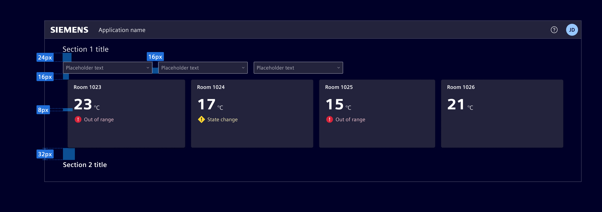
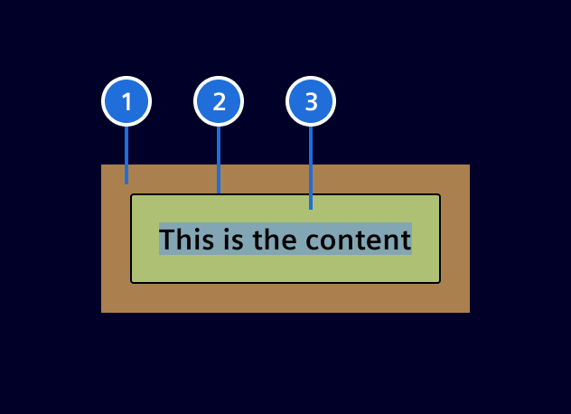

# Spacing

Space is the distance between elements.
It's used to complement the purpose of a screen, by creating hierarchy
and helping the content to become more useful and understandable.

## Usage ---

Thoughtful and intentional spacing between elements plays a
crucial role in creating relationships
and establishing hierarchy within a design.


### Principles

#### Visual grouping

Space shapes the visual connection between elements.
The more items are related, the closer they should be to each other.

#### Hierarchy and balance

Elements with more space around them are perceived as having higher importance,
while elements with less space are seen as subordinate.

#### White space

Incorporating empty space (also known as white space) as a deliberate element is essential.
While certain sections may be dense, it is important to value and utilize
white space throughout the entire layout, as it enhances visual clarity.

### Best practices

- It is allowed to use spacing values that are not explicitly defined in the scale,
  as long as they adhere to the [grid system](grid.md).
- Element provides general spacing guidelines. Adjust according to the content density in the screen.
- It is acceptable to adjust the spacing at page breakpoints in order to fit better the elements in the screen.

## Design ---

### Spacing scale

The spacing scale complements 8px baseline grid and typography scale
by using multiples of two, four, and eight.

Spacings can be defined via pixels or relative to the root font size (`rem`).
Pixel values are preferred for layout and general spacing. `rem` values should
be used for font size related values as they provide better accessibility.

> Note: Px to rem conversion is based on 1rem = 16px

| **Token**  | **px** | **rem** | **CSS utility class**  |
|------------|--------|---------|------------------------|
| spacing-1  | 2      | 0.125   | `{property}{sides}-1`  |
| spacing-2  | 4      | 0.25    | `{property}{sides}-2`  |
| spacing-3  | 6      | 0.375   | `{property}{sides}-3`  |
| spacing-4  | 8      | 0.5     | `{property}{sides}-4`  |
| spacing-5  | 12     | 0.75    | `{property}{sides}-5`  |
| spacing-6  | 16     | 1       | `{property}{sides}-6`  |
| spacing-7  | 20     | 1.25    | `{property}{sides}-7`  |
| spacing-8  | 24     | 1.5     | `{property}{sides}-8`  |
| spacing-9  | 32     | 2       | `{property}{sides}-9`  |
| spacing-10 | 64     | 4       | `{property}{sides}-10` |
| spacing-11 | 96     | 6       | `{property}{sides}-11` |

Visit [code](spacing.md#code) tab for more technical details.

### Applying spacing

Refer to the following suggested space definitions.
Spacing may vary according to the content density.
We encourage designing with rhythm and contrast to achieve clear visual hierarchy.

- `8px` is base unit for creating small separations between text lines or closely related components.
- `16px` is the commonly used spacing unit for providing adequate breathing room between components.
- Place `24px` around headings. Use it to provide larger gaps between visually dense components.
- Apply `32px` spacing between sections to provide clear visual breaks and aid in content grouping.
- `64px` or larger: Reserved for larger spacing needs, such as creating substantial visual separations or emphasising content.



### Margin vs. padding



> 1. Margin, 2. Border (part of padding),  3. Padding

Embedding border to padding is standard on all component implementations. The
following CSS code is enabling this behavior.

```css
box-sizing: border-box;
```

## Code ---

The classes are named using the format `{property}{sides}-{size}` for `xs` and
`{property}{sides}-{breakpoint}-{size}` for `sm`, `md`, `lg`, and `xl`.

Where *property* is one of:

- `m` - for classes that set `margin`
- `p` - for classes that set `padding`

Where *sides* is one of:

- `t` - for classes that set `margin-top` or `padding-top`
- `b` - for classes that set `margin-bottom` or `padding-bottom`
- `s` - for classes that set `margin-left` or `padding-left` (s for start)
- `e` - for classes that set `margin-right` or `padding-right` (e for end)
- `x` - for classes that set both `*-left` and `*-right`
- `y` - for classes that set both `*-top` and `*-bottom`
- blank - for classes that set a `margin` or `padding` on all 4 sides of the element

Where size is one of:

- `0` - for classes that eliminate the `margin` or `padding` by setting it to `0`
- `1` - for classes that set the `margin` or `padding` to `2px`
- `2` - for classes that set the `margin` or `padding` to `4px`
- `3` - for classes that set the `margin` or `padding` to `6px`
- `4` - for classes that set the `margin` or `padding` to `8px`
- `5` - for classes that set the `margin` or `padding` to `12px`
- `6` - for classes that set the `margin` or `padding` to `16px`
- `7` - for classes that set the `margin` or `padding` to `20px`
- `8` - for classes that set the `margin` or `padding` to `24px`
- `9` - for classes that set the `margin` or `padding` to `32px`
- `10` - for classes that set the `margin` or `padding` to `64px`
- `11` - for classes that set the `margin` or `padding` to `96px`
- `auto` - for classes that set the `margin` to `auto`
- `nX` - for classes that set the margin to negative `X`, where 'X' is a number from above

<si-docs-component example="spacing/spacing" height="250"></si-docs-component>

### Sass variables

All spacing values can also be accessed via SASS within the `$spacers` map.
Use the accessor function `map.get($spacers, SIZE)` where `SIZE` is on of the
above defined spacing options.

```scss
@use 'sass:map';

@use '@siemens/element-theme/src/styles/variables';

padding-top: map.get(variables.$spacers, 6);
```
